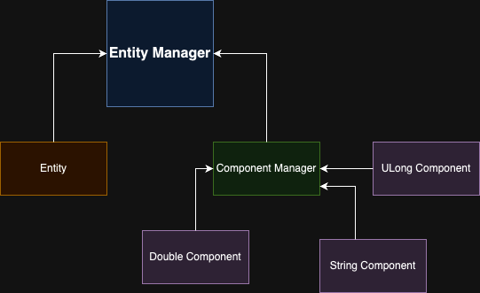

# Entity Manager

## Description
The EntityManager is a component of the GameEngine that manages the creation, deletion, and retrieval of entities within the game. It provides a centralized interface for managing the game's entities and their associated components.



## Usage
To use the EntityManager in your game, follow these steps:

1. Initialize the EntityManager by creating an instance of it.
```cpp
Engine::Entity::EntityManager manager;
```
2. Create entities using the `createEntity()` method, which returns a unique entity ID.

```cpp
manager.createEntity();
```

3. Add components to entities using the `addComponent(entityId, component)` method.

```cpp
manager.addComponent(manager.getEntity(id), component);
```

4. Retrieve components from entities using the `getComponent(entityId, componentType)` method.

```cpp

```

5. Delete entities using the `deleteEntity(entityId)` method.

```cpp
manager.destroyEntity(entities[id])
```

Here's an example of how to use the EntityManager:

```cpp

#include <array>

#include "EntityManager/ComponentManager/ComponentManager.hpp"
#include "EntityManager/ComponentManager/GenericComponents/ULongComponent/ULongComponent.hpp"
#include "EntityManager/ComponentManager/GenericComponents/StringComponent/StringComponent.hpp"
#include "EntityManager/ComponentManager/GenericComponents/DoubleComponent/DoubleComponent.hpp"
#include "EntityManager/EntityManager.hpp"


int main() {
    std::array<std::uint32_t, 100> entities;
    Engine::Entity::EntityManager manager;
    Engine::Entity::Component::GenericComponents::ULongComponent component(
        0, "ULongComponent", (std::uint64_t)10);
    Engine::Entity::Component::GenericComponents::StringComponent component2(
        0, "StringComponent", "Hello World");
    Engine::Entity::Component::GenericComponents::DoubleComponent component3(
        0, "DoubleComponent", (double)10.5);
    for (int i = 0; i < 1; i++) {
        entities[i] = manager.createEntity();
        manager.addComponent(manager.getEntity(i), component);
        manager.addComponent(manager.getEntity(i), component2);
        manager.addComponent(manager.getEntity(i), component3);
    }

    if (manager.hasComponent(manager.getEntity(0), "ULongComponent")) {
        std::cout << "Has ULongComponent" << std::endl;
    }

    manager.removeComponent(manager.getEntity(0), "all");

    for (int i = 0; i < 1; i++) manager.destroyEntity(entities[i]);

    return 0;
}
```

## Documentation

```cpp
EntityManager();
```
This constructor will init all the possible entities


```cpp
std::uint32_t CreateEntity();
```

This method will create an entity and return the ID of the created entity
it will also pop an entity ID from the available entities pool and increment the living entity count.


```cpp
Entity& getEntity(std::uint32_t id);
```

This method will get an entity with his ID and will return the entity.

```cpp
void destroyEntity(const std::uint32_t &entity_id);
```

This method will Destroy an entity with his ID, it will also add back the entity the the available entities pool, and decrement the living entity count

```cpp
void addComponent(Entity &entity, Component::IComponent &component);
```

This method will add a component to an entity

```cpp
void removeComponent(Entity &entity, std::string component_name);
```

this method will remove a component from an entity. if you give "all" as parameter it will remove all the component

```cpp
bool hasComponent(Entity &entity, std::string component_name);
```

this method will check if an entity have the component.

## Authors

Anton Jourd'heuil
