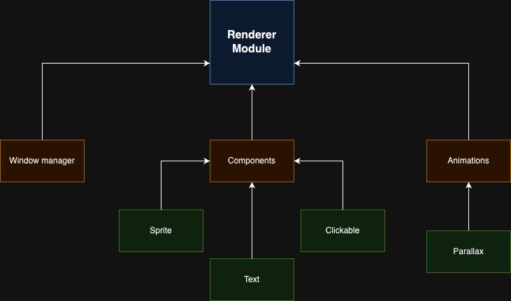

# Renderer Module

## Overview

The `RendererModule` directory in the R-Type project contains the `RendererModule` class, which is responsible for handling rendering tasks using the Simple and Fast Multimedia Library (SFML). This class manages the initialization of the rendering window, updates rendering content, and performs rendering operations.



## Structure Explanation

### `RendererModule` Class

```cpp
namespace Engine {
    namespace RendererModule {
        class RendererModule {
        public:
            // Constructor for initializing the RendererModule instance.
            RendererModule();

            // Destructor for cleanup.
            ~RendererModule();

            // Method to initialize the rendering module.
            void init();

            // Method to update the rendering content.
            void update();

            // Method to perform rendering operations.
            void render();

        protected:
        private:
            sf::RenderWindow _window;
            sf::Event _event;  // to be removed if an event manager is implemented.
        };
    };  // namespace RendererModule
};      // namespace Engine
```

#### Public Methods

- **Constructor (`RendererModule()`) and Destructor (`~RendererModule()`)**
  - The constructor initializes the `RendererModule` instance.
  - The destructor is responsible for any necessary cleanup when the `RendererModule` is no longer needed.

- **`void init()`**
  - Method to initialize the rendering module. This may include setting up the rendering window, configuring rendering options, or loading initial assets.

- **`void update()`**
  - Method to update the rendering content. This could involve handling user input, managing animations, or updating other aspects of the rendering process.

- **`void render()`**
  - Method to perform rendering operations. This is where the actual drawing of graphics takes place, utilizing the SFML library.

#### Private Members

- `_window`: SFML rendering window.
- `_event`: SFML event object (to be removed if an event manager is implemented).

## Usage

The `RendererModule` class is designed to be used for rendering graphics within the R-Type project. It provides methods to initialize the rendering module, update rendering content, and perform rendering operations. The SFML library is employed to streamline these tasks.

### Example Usage

```cpp
#include "RendererModule.hpp"

int main() {
    // Create a RendererModule instance
    Engine::RendererModule::RendererModule rendererModule;

    // Initialize the rendering module
    rendererModule.init();

    // Game loop
    while (/* condition */) {
        // Update and render the content
        rendererModule.update();
        rendererModule.render();
    }

    return 0;
}
```

In this example, a `RendererModule` instance is created, initialized, and utilized within a game loop for updating and rendering. Customize the usage based on the rendering requirements of your project.